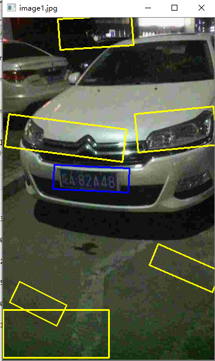

# 车牌定位
## 一、整体思路
+ 图像处理
+ 机器学习

车牌定位部分采用图像处理部分的技术，在图像处理之后，加入机器学习的分类器来优化车牌定位。

#### 1. **为什么要加如机器学习?**
图像处理识别车牌会出现如下问题：

如图，图片中的矩形框是当靠图像处理初步定位到车牌的位置，可以发现，有很多定位错位的地方。

所以本人结合机器学习，搜集了1800多个带标签的样本数据，进行训练学习，训练好模型之后，将上图中的所有矩形框进行预测，根据学得的模型来判别是否真的是车牌的位置。

(值的注意的地方：本人在这个地方选择的带标签的样本数据是图片中的矩形框，比如这张图片上有7个样本数据)

当模型分类器预测出某一个矩形框的位置是车牌的位置，即用蓝框表示，否则使用黄框表示。

## 二、项目目录结构结束
### 1. 机器学习相关文件
+ docs/dataset: 数据集
+ docs/model: 机器学习训练好的模型
             
    参考博客：https://blog.csdn.net/pentiumCM/article/details/104370401
+ docs/scaler: 数据集标准化的模型

+ Img: 车牌照片

### 2.代码
+ license_plate_recognition：所有代码的顶级目录
+ license_plate_recognition/license_plate_localization：车牌定位的代码
+ license_plate_recognition/license_plate_localization/nb_clf.py：朴素贝叶斯模型
+ license_plate_recognition/license_plate_localization/svm_clf.py：支持向量机模型
+ license_plate_recognition/license_plate_localization/LPBinaryOSTU1.py：车牌识别图像处理代码

#### 以上代码逻辑关系：

第一步、执行nb_clf.py或者svm_clf.py进行模型训练，训练好的模型会保存在：docs/model中

第二步、LPBinaryOSTU1.py部分会加载训练好的模型，在图像初步处理完之后，会使用分类器对这些初步定位的矩形框进行预测

## 三、项目依赖管理
本人推荐使用anaconda + requirements.txt

requirements.txt使用参考博客：https://blog.csdn.net/pentiumCM/article/details/104288735

## 四、总结
目前朴素贝叶斯的模型效果比较好，采用的是留出法评估模型，准确率为：0.9174434087882823

支持向量机效果不太理想，还在优化调整中。。。

